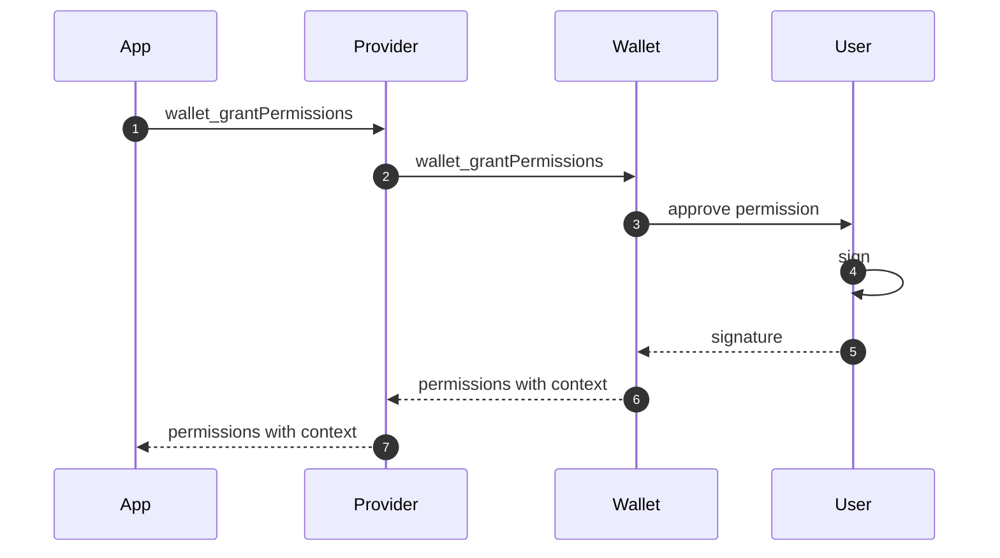
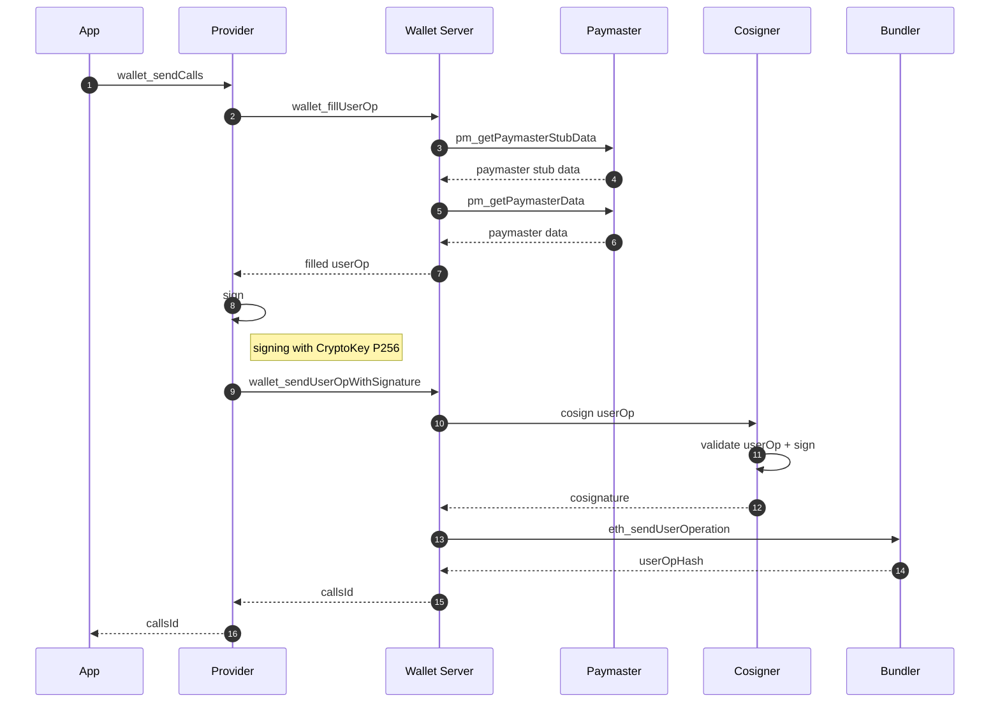

# Smart Wallet Permissions

**Permissions enable apps to submit transactions on behalf of users.**

Permissioned transactions can avoid typical user friction in web3 apps like:

- Wallet popup windows
- Passkey biometric scans
- User presence in-app

Permissions unlock experiences that keep all of the unique properties of wallets (self-custody, data portability, etc.) without sacrificing on user experience compared to web2:

- Sign-in and never see mention of a wallet again
- High-frequency transactions (gaming, social, etc.)
- Background transactions (automated trading, subscriptions, etc.)

## Get started

> **Note**: These contracts are unaudited and are only recommended for testing purposes. Use at your own risk.

### 0. Integrate Coinbase Smart Wallet into your app.

The [smartwallet.dev](https://www.smartwallet.dev/why) docs are recommended.

### 1. Add support for permissioned user operations to call your smart contract.

```solidity
import {PermissionCallable} from "smart-wallet-permissions/src/permissions/PermissionCallable/PermissionCallable.sol";

contract Contract is PermissionCallable {
    // define which function selectors are callable by permissioned userOps
    function supportsPermissionedCallSelector(bytes4 selector) public pure override returns (bool) {
        return selector == Contract.foo.selector;
    }
    // callable by permissioned userOps
    function foo() external;
    // not callable by permissioned userOps
    function bar() external;
}
```

### 2. Reach out for access to our Private Alpha on Base Sepolia.

Join our [Telegram group](https://t.me/+r3nLFnTj6spkNzdh) and post a message describing your project and intended use of Smart Wallet Permissions.

## Sample flows

Coinbase is actively contributing to [ERC-7715](https://eip.tools/eip/7715) which is the intended way to use Smart Wallet Permissions.

### 1. Grant permissions



### 2. Send calls with `permissions.context` capability


