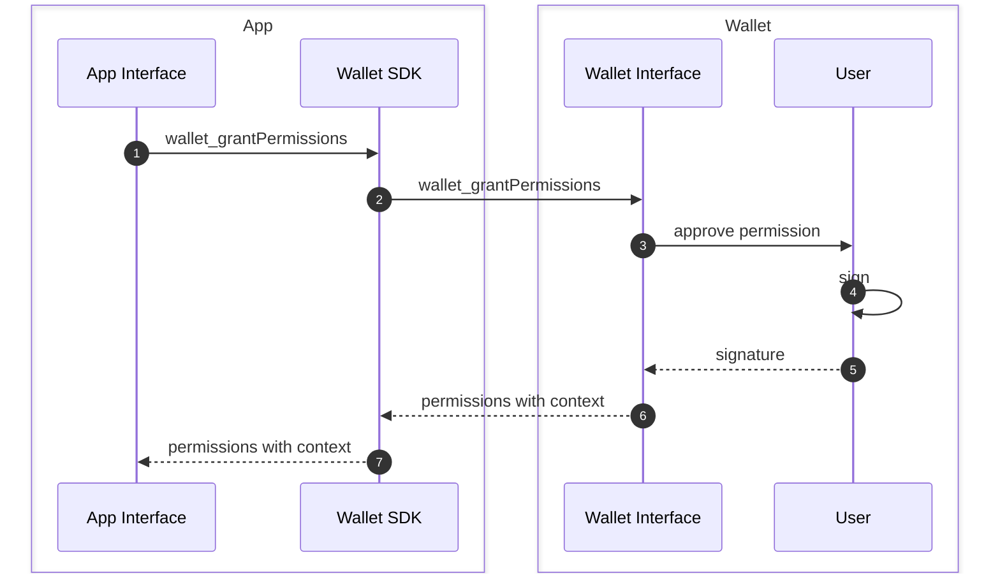
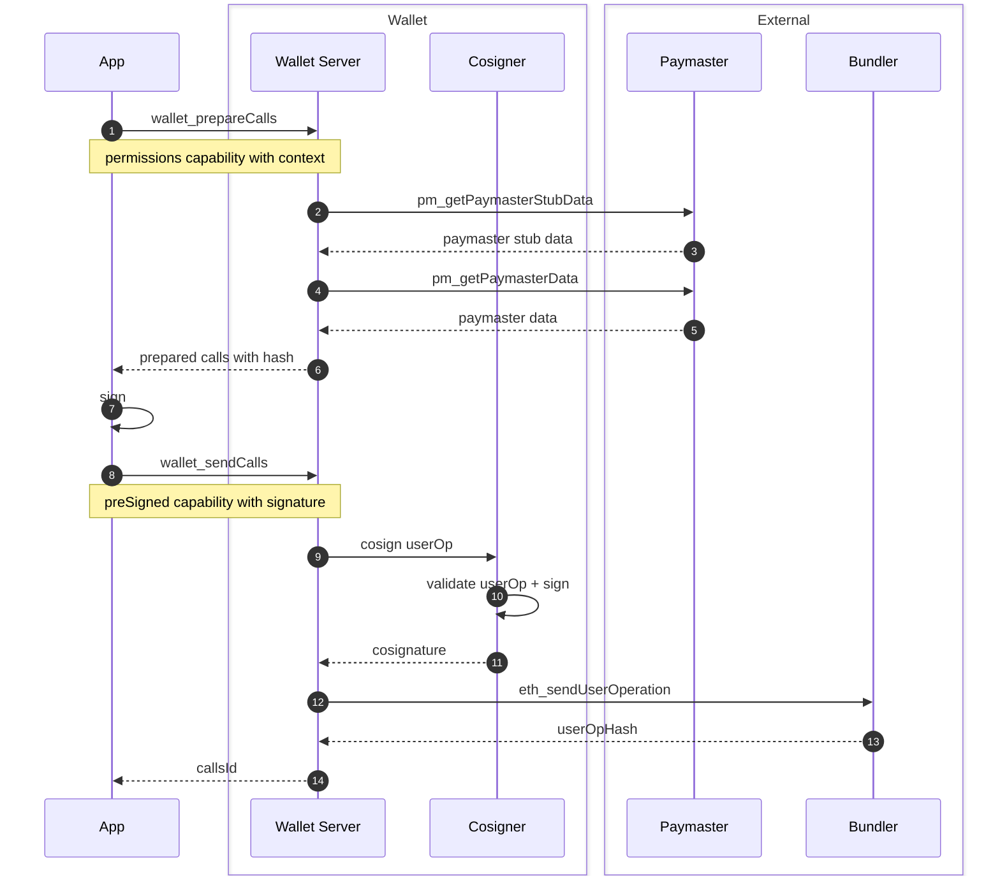

# Smart Wallet Permissions

**Permissions enable apps to submit transactions on behalf of users.**

Permissioned transactions can avoid typical user friction in web3 apps like:

- Wallet popup windows
- Passkey biometric scans
- User presence in-app

Permissions unlock experiences that keep all of the unique properties of wallets (self-custody, data portability, etc.) without sacrificing on user experience compared to web2:

- Sign-in and never see mention of a wallet again
- High-frequency transactions (gaming, social, etc.)
- Background transactions (automated trading, subscriptions, etc.)

## Get started

> **Note**: These contracts are currently unaudited and are only recommended for testing purposes. Use at your own risk.

Read about how to [get started here](./docs/examples/).

## Sample flows

Coinbase is actively contributing to [ERC-7715](https://eip.tools/eip/7715) which is the intended way to use Smart Wallet Permissions.

### 1. Grant permissions

### 2. Prepare, sign, and send calls

