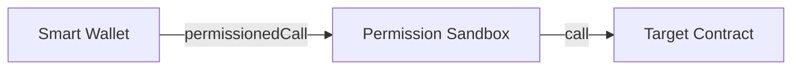
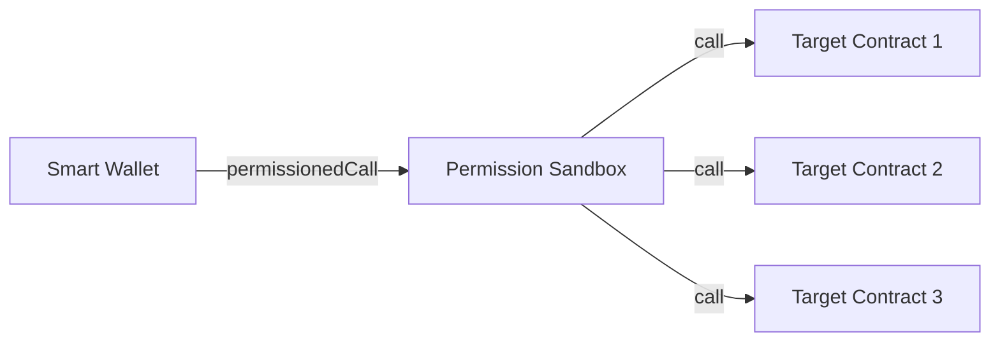

# Permissioned Call

**Permission Call enable apps to safely and permissionlessly integrate Smart Wallet Permissions in their application.**

The default approach to enable this is for a permission to enable calling arbitrary contracts with arbitrary function selectors and arguments. Even with controls for users to allowlist specific contracts/selectors/arguments, we believe this model is insecure.

Users are not able to evaluate if a specific contract/selector/argument is safe or not for them to approve and the long tail of interactions make building an automated system to flag potentially dangerous behavior difficult. It's too easy for an app to ask for permission to make a malicious external call and for a user to blindly approve it.

The key insight is for contracts to intentionally support permissioned calls. This sets us up for immediate backwards **incompatibilty**, which is actually a security feature because by default many potentially hazardous external calls are prevented. The most glaring problems with this approach are making it convenient enough for smart contract developers to add this support and dealing with non-upgradeable contracts.

Currently, we achieve contract opt-in through requiring them to implement a new function `permissionedCall(bytes call) payable returns (bytes)`. The function takes in a single `bytes call` argument expected to be formatted as calldata that exactly matches another function on the contract. With this data, `permissionedCall` simply makes a self-delegatecall, retaining the same call context for the underlying function, and returning the same data back to the original call sender.

Offchain, apps do not have to change how they currently encode calls to their contract (e.g. wagmi’s `useWriteContracts`) because the wallet's user operation preparation will wrap their provided calls in this new selector. For onchain validation, the Permission Contract enforces that only external calls using the `permissionedCall` selector are allowed.

Additionally, we encourage smart contract developers to intentionally support permissioned calls for the functions that need it. Some functionality may be irreversible or high-severity to the point that ensuring users are involved in the final signing process is useful friction. Contracts are also expected to implement `supportsPermissionedCallSelector(bytes4 selector) view returns (bool)` which declares if a specific function selector is supported or not through `permissionedCall`. This pattern takes inspiration from [EIP-165](https://eips.ethereum.org/EIPS/eip-165) and easily enables granular selector filtering or enabling all selectors with `return true`. We provide a default [`PermissionCallable`](./PermissionCallable.sol) implementation that developers can inherit directly in their contracts. We do not recommend using this contract in production until our audit has completed.

```solidity
import {PermissionCallable} from "smart-wallet-permissions/mixins/PermissionCallable.sol";

contract Contract is PermissionCallable {
    // define which function selectors are callable by permissioned userOps
    function supportsPermissionedCallSelector(bytes4 selector) public pure override returns (bool) {
        return selector == Contract.foo.selector;
    }

    // callable by permissioned userOps
    function foo() external;

    // not callable by permissioned userOps
    function bar() external;
}
```

Non-upgradeable contracts make implementing `permissionedCall` difficult, but not impossible in some cases. For contracts that do not have strict use of `msg.sender` for authorization, we have found success in deploying a new middleware contract that implements `permissionedCall` and forwards calls to the target contract.



For cases where you only want to ask for one permission approval to interact with many contracts, the middleware pattern can also help isolate a single address to get permission to call. Note that the middleware contract obscures the original Smart Wallet address which would normally be `msg.sender` in the context of the target contracts, which makes it default secure but also potentially incompatible.



We are continuing to build out a set of examples that help developers grab a pre-made solution. If you feel like you do not have a clear way to implement `permissionedCall`, please reach out in our [Discord](https://discord.com/invite/cdp/).
