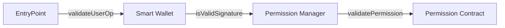

# Smart Wallet Permissions Docs

> :information_source: These contracts are unaudited. Please use at your own risk.

With [ERC-7715](./ERC-7715.md), users can grant permissions to apps to submit transactions on their behalf. These docs are meant to walk you through the key design decisions and mechanisms that chose to enable this feature at the contract layer. Reading all linked resources is encouraged to get the full depth of design intuition.

## Design Overview

### 1. ERC-4337 alignment

Our first iteration chose to lean into the patterns defined by [ERC-4337](https://eips.ethereum.org/EIPS/eip-4337) for actually executing onchain. This allowed us to share infrastructure Coinbase and many other teams have invested in for Bundlers and Paymasters. It also absolved us of redesigning a solution for problems that the Entrypoint already solves like DoS protection via separation of validation and execution phases and modularizing gas payment.

### 2. Optional addition to Coinbase Smart Wallet V1

While implementing this feature as a new V2 wallet implementation was tempting, we decided to leverage the modular owner system from [Smart Wallet V1](https://github.com/coinbase/smart-wallet) and avoid a hard upgrade. This helped reduce our launch timeline and also reduced the risk of introducing this substantially different account authentication paradigm.

We accomplished this by writing a new singleton contract, [`PermissionManager`](./PermissionManager.md), which can be optionally added as an owner to existing accounts your first time encountering an app that uses Session Keys or during accounts creation.

### 3. Generic/Specific permission validation split

The Permission Manager is responsible for validating permissioned user operations. There are many kinds of permissions we expect developers to request over time, so we chose a modular design where permission-specific validations are delegated to a Permission Contract. The Permission Manager will initially validate the core properties of a permissioned user operation (e.g. authorized by user, not expired) and then call the Permission Contract to perform additional checks (e.g. allowed contract calls).

### 4. Tightly-scoped first Permission Contract

For the V1 launch, we will only support one Permission Contract with select features:

- spend native token (ETH) with a [recurring allowance](./RecurringAllowance.md)
- withdraw assets from [MagicSpend](https://github.com/coinbase/magic-spend)
- call external contracts with a [single, required selector](./PermissionedCall.md)
- sponsor transactions with a [required paymaster](./PaymasterRequirement.md)

While we believe these capabilities unlock many valuable use cases, some integrations will not yet be possible. We encourage you to join our [Discord](<(https://discord.com/invite/cdp/)>) and submit feedback in `#smart-wallet` for your feature requests and use case to help shape our roadmap. Currently, adding support for ERC20 and more function selectors are top priorities.

### 5. Validation/Execution phase checks split

To be compatible with ERC-4337, we had to adhere to the restrictions during validation phase defined in [ERC-7562](https://eips.ethereum.org/EIPS/eip-7562). One pattern we employed both for the Permission Manger and Permission Contract is to have two sets of checks with as many as possible in validation phase and then a select few in execution phase. We make these execution-phase checks by packing additional calls into the call batch sent to the Smart Wallet in `userOp.calldata` and we enforce their precense in this calldata during validation phase. If any of these execution-phase checks fail, the entire user operation execution fails.

## End-to-end Journey

### 1. App requests permissions from user (offchain)

View a sample sequence diagram [here](./diagrams/offchain/grantPermissions.md) and Smart Wallet's supported capabilities [here](./ERC-7715.md).

### 2. App prepares and sends calls (offchain)

View a sample sequence diagram [here](./diagrams/offchain/prepareCalls+sendCalls.md).

### 3. Bundler executes User Operation (onchain)

View a sample sequence diagram [here](./diagrams/onchain/withdraw.md).
