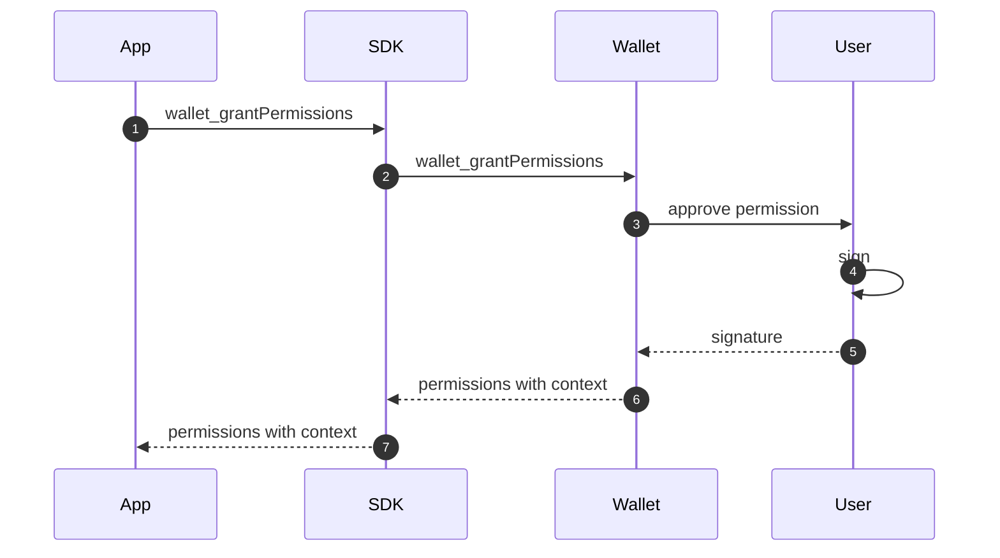

## Grant Permissions

```mermaid
sequenceDiagram
    autonumber
    participant A as App
    participant SDK as SDK
    participant W as Wallet
    participant U as User

    A->>SDK: wallet_grantPermissions
    SDK->>W: wallet_grantPermissions
    W->>U: approve permission
    U->>U: sign
    U-->>W: signature
    W-->>SDK: permissions with context
    SDK-->>A: permissions with context
```
