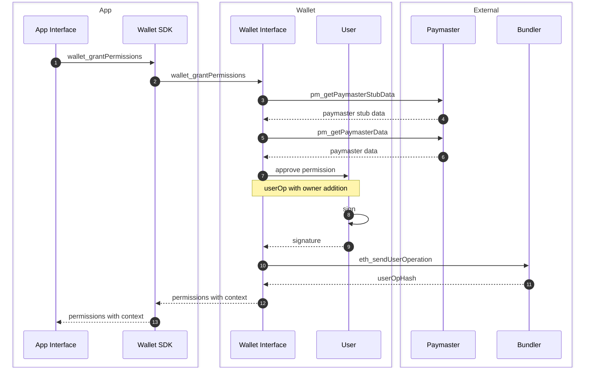

## First-Time Approval

Existing Smart Wallets must first add the Permission Manager as an owner in order for it to process permissioned user operations. This owner addition also needs to be replayed for each network the user tries to transact on. Our goal is to minimize confirmation steps for users to enable this, so we lean into combining our existing replayable user operation mechanism with our ability to batch permission approval calls in a user operation.

First, we need to the user to sign a chain-agnostic, zero-gas user operation that adds the Permission Manager as an owner. The chain-agnosticism and zero-gas parameters allow anyone to submit this user operation to an Entrypoint on any network in any gas conditions and still execute the owner change.

When a user makes their first permission approval on a chain, Smart Wallet pulls this signed user operation and batch two calls together to add the owner and approve the permission.

Smart Wallet asks the user to sign this new user operation, submits it to a bundler, and waits for it to land onchain before returning the permission `context` back to the app. Because we did not have the user sign the permission in isolation, the `approval` field on the `Permission` struct will be empty bytes (`0x`). The app does not know there is any difference between this context and a normal one and proceeds as normal to provide this context in future calls to submit Session Key user operations.

