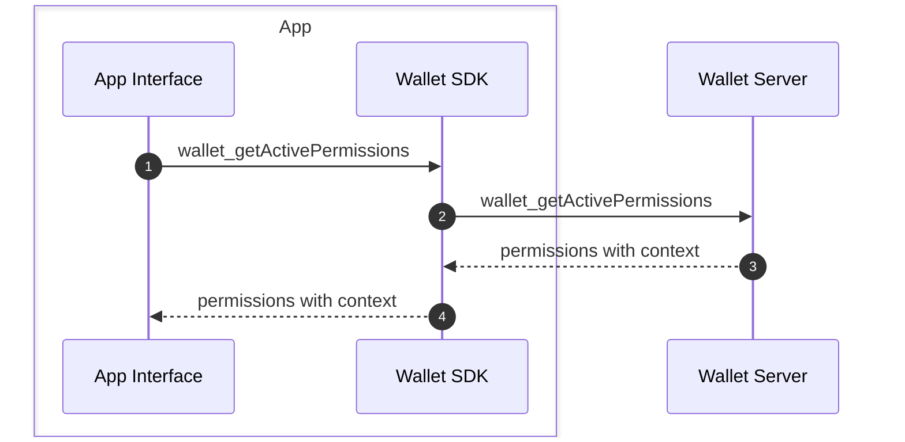

## Get Active Permissions

```mermaid
sequenceDiagram
    autonumber
    box transparent App
        participant A as App Interface
        participant SDK as Wallet SDK
    end
    participant WS as Wallet Server

    A->>SDK: wallet_getActivePermissions
    SDK->>WS: wallet_getActivePermissions
    WS-->>SDK: permissions with context
    SDK-->>A: permissions with context
```
