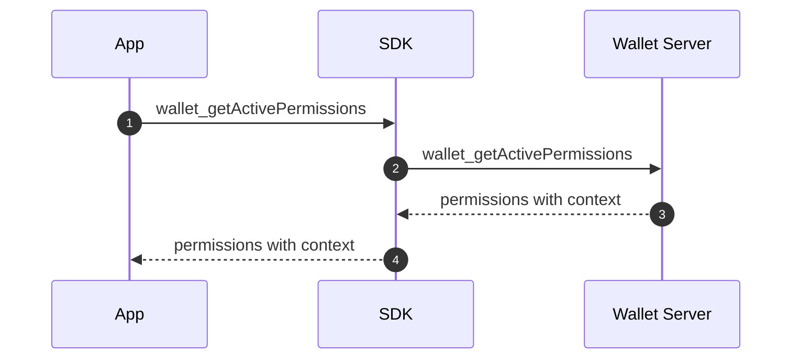

## Get Active Permissions

```mermaid
sequenceDiagram
    autonumber
    participant A as App
    participant SDK as SDK
    participant WS as Wallet Server

    A->>SDK: wallet_getActivePermissions
    SDK->>WS: wallet_getActivePermissions
    WS-->>SDK: permissions with context
    SDK-->>A: permissions with context
```
