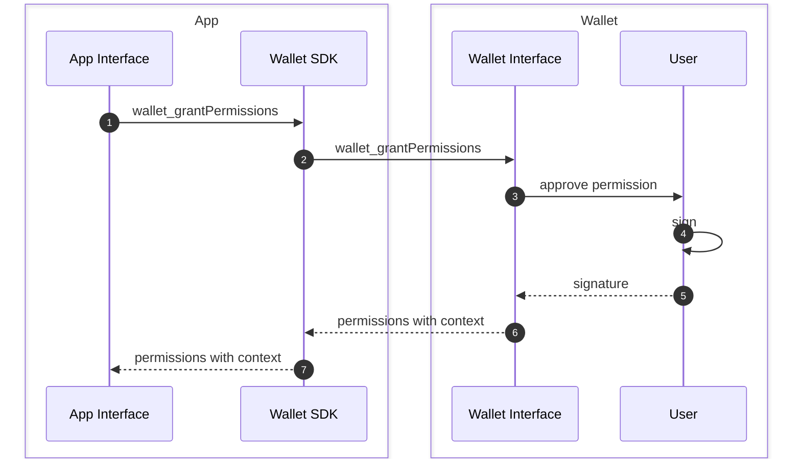

## Grant Permissions

```mermaid
sequenceDiagram
    autonumber
    box transparent App
        participant A as App Interface
        participant SDK as Wallet SDK
    end
    box transparent Wallet
        participant W as Wallet Interface
        participant U as User
    end

    A->>SDK: wallet_grantPermissions
    SDK->>W: wallet_grantPermissions
    W->>U: approve permission
    U->>U: sign
    U-->>W: signature
    W-->>SDK: permissions with context
    SDK-->>A: permissions with context
```
