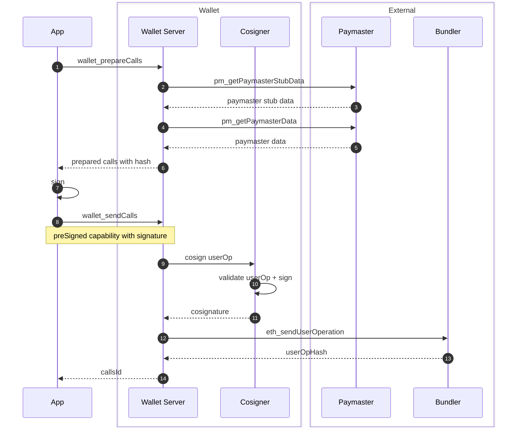

## Prepare Calls and Send Pre-Signed Calls

General flow for sending user operations with a Wallet Server. Supports server signers and our own Wallet A (see [sendCalls+permissionsContext](./sendCalls+permissionsContext.md)).

