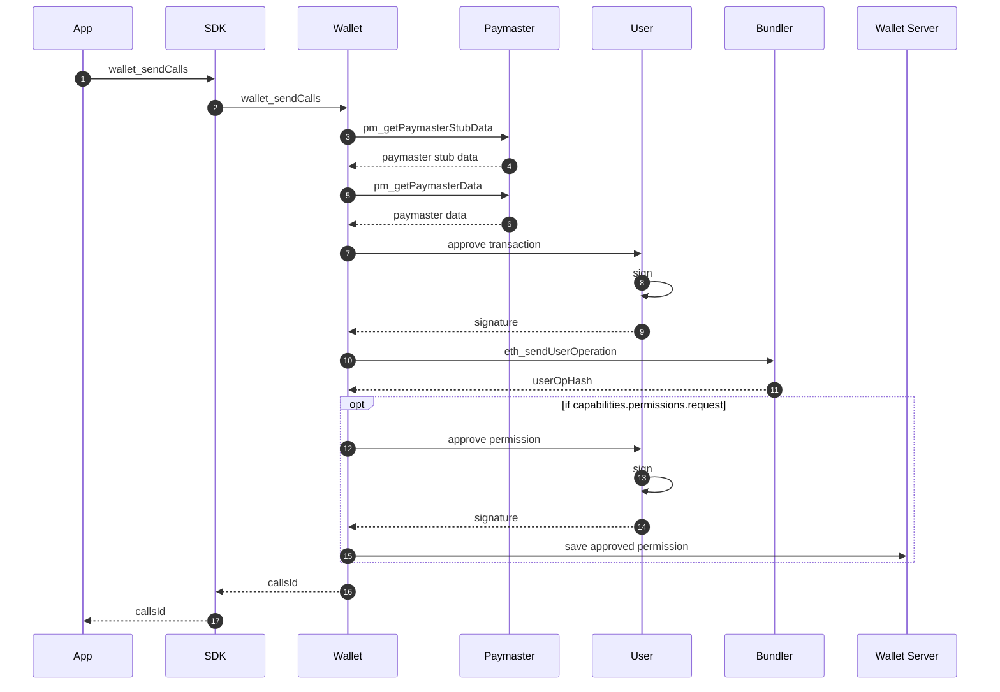

## Send Calls with Grant Permissions Capability

```mermaid
sequenceDiagram
    autonumber
    participant A as App
    participant SDK as SDK
    participant W as Wallet
    participant P as Paymaster
    participant U as User
    participant B as Bundler
    participant WS as Wallet Server

    A->>SDK: wallet_sendCalls
    SDK->>W: wallet_sendCalls
    W->>P: pm_getPaymasterStubData
    P-->>W: paymaster stub data
    W->>P: pm_getPaymasterData
    P-->>W: paymaster data
    W->>U: approve transaction
    U->>U: sign
    U-->>W: signature
    W->>B: eth_sendUserOperation
    B-->>W: userOpHash
    opt if capabilities.permissions.request
    W->>U: approve permission
    U->>U: sign
    U-->>W: signature
    W->>WS: save approved permission
    end
    W-->>SDK: callsId
    SDK-->>A: callsId
```
