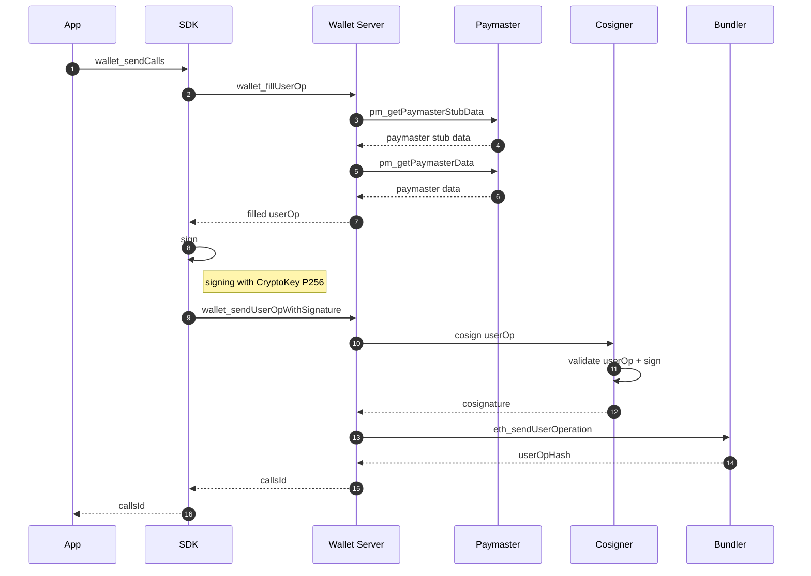

## Send Calls with Permissions Context Capability

```mermaid
sequenceDiagram
    autonumber
    participant A as App
    participant SDK as SDK
    participant WS as Wallet Server
    participant P as Paymaster
    participant CS as Cosigner
    participant B as Bundler

    A->>SDK: wallet_sendCalls
    SDK->>WS: wallet_fillUserOp
    WS->>P: pm_getPaymasterStubData
    P-->>WS: paymaster stub data
    WS->>P: pm_getPaymasterData
    P-->>WS: paymaster data
    WS-->>SDK: filled userOp
    SDK->>SDK: sign
    Note right of SDK: signing with CryptoKey P256
    SDK->>WS: wallet_sendUserOpWithSignature
    WS->>CS: cosign userOp
    CS->>CS: validate userOp + sign
    CS-->>WS: cosignature
    WS->>B: eth_sendUserOperation
    B-->>WS: userOpHash
    WS-->>SDK: callsId
    SDK-->>A: callsId
```
