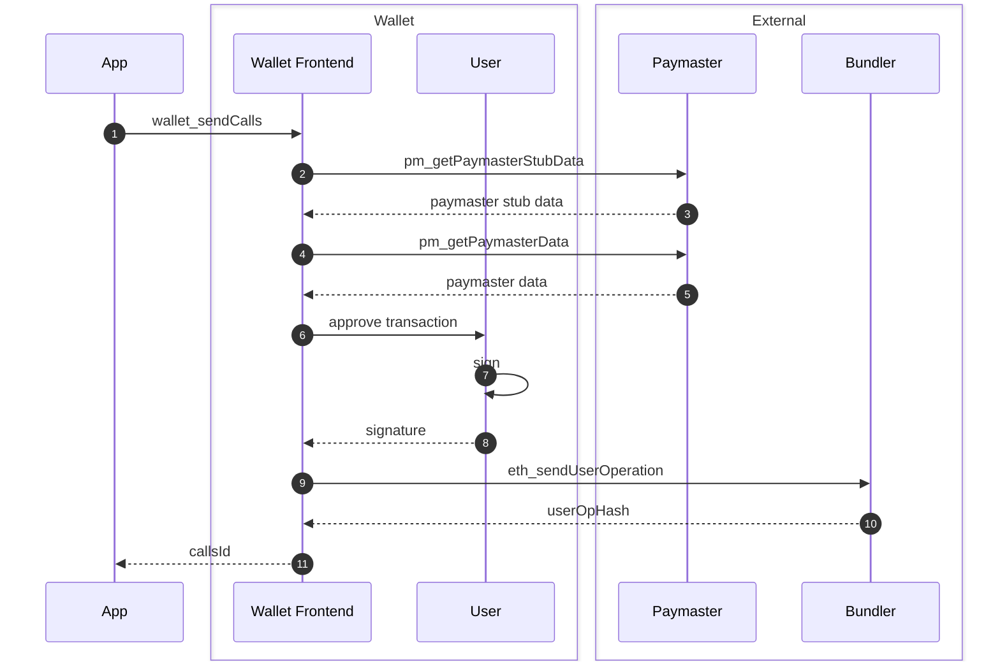

## Normal Send Calls

Reference point for how a normal `wallet_sendCalls` request is handled by Smart Wallet.

```mermaid
sequenceDiagram
    autonumber
    participant A as App
    box transparent Wallet
        participant WF as Wallet Frontend
        participant U as User
    end
    box transparent External
        participant P as Paymaster
        participant B as Bundler
    end

    A->>WF: wallet_sendCalls
    WF->>P: pm_getPaymasterStubData
    P-->>WF: paymaster stub data
    WF->>P: pm_getPaymasterData
    P-->>WF: paymaster data
    WF->>U: approve transaction
    U->>U: sign
    U-->>WF: signature
    WF->>B: eth_sendUserOperation
    B-->>WF: userOpHash
    WF-->>A: callsId
```
