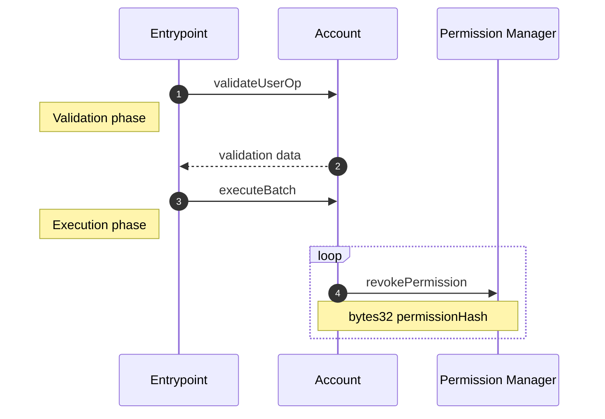

## Batch Revoke Permissions

Accounts can batch-revoke permissions via batching `revokePermission` calls to `PermissionManager`.

```mermaid
sequenceDiagram
    autonumber
    participant E as Entrypoint
    participant A as Account
    participant M as Permission Manager

    E->>A: validateUserOp
    Note left of E: Validation phase
    A-->>E: validation data
    E->>A: executeBatch
    Note left of E: Execution phase
    loop
        A->>M: revokePermission
        Note over A,M: bytes32 permissionHash
    end
```
