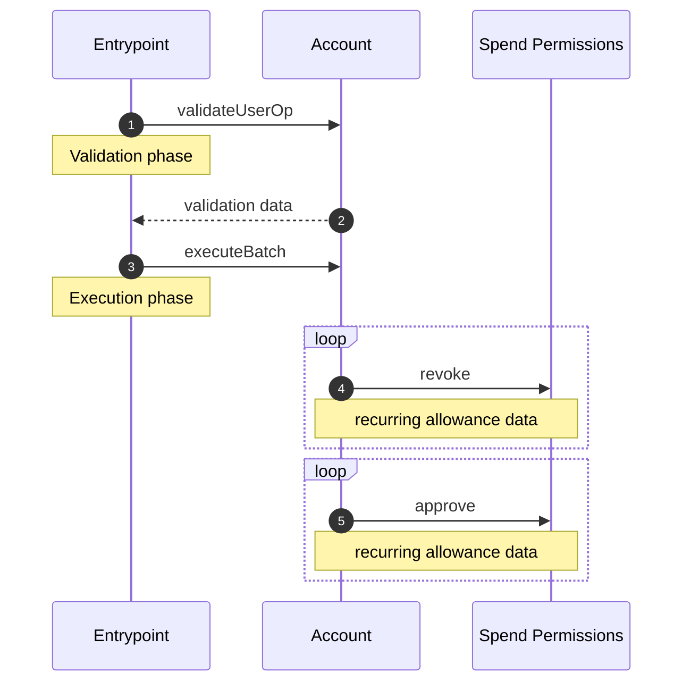

## Batch Update Permissions

Accounts can batch-revoke/approve/update permissions via batching `revoke` and `approve` calls to `SpendPermissionManager`.

```mermaid
sequenceDiagram
    autonumber
    participant E as Entrypoint
    participant A as Account
    participant SP as Spend Permissions

    E->>A: validateUserOp
    Note over E: Validation phase
    A-->>E: validation data
    E->>A: executeBatch
    Note over E: Execution phase
    loop
        A->>SP: revoke
        Note over A,SP: recurring allowance data
    end
    loop
        A->>SP: approve
        Note over A,SP: recurring allowance data
    end
```
