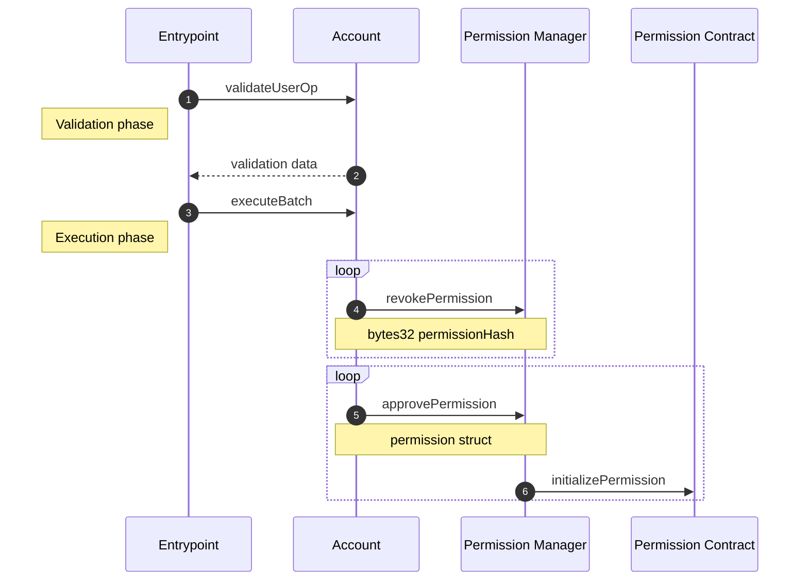

## Batch Update Permissions

Accounts can batch-update permissions via batching `revokePermission` and `approvePermission` calls to `PermissionManager`.

```mermaid
sequenceDiagram
    autonumber
    participant E as Entrypoint
    participant A as Account
    participant M as Permission Manager
    participant P as Permission Contract

    E->>A: validateUserOp
    Note left of E: Validation phase
    A-->>E: validation data
    E->>A: executeBatch
    Note left of E: Execution phase
    loop
        A->>M: revokePermission
        Note over A,M: bytes32 permissionHash
    end
    loop
        A->>M: approvePermission
        Note over A,M: permission struct
        M->>P: initializePermission
    end
```
