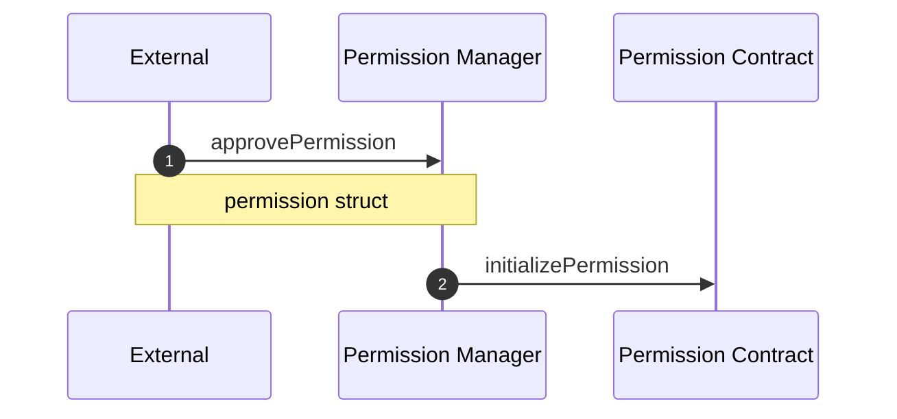

## Cache Permissions

After permission approval signatures are exposed publicly, anyone can use that signature to save the approval in storage. Doing so can save gas as it removes the additional signature calldata and external call + validation of the signature.

