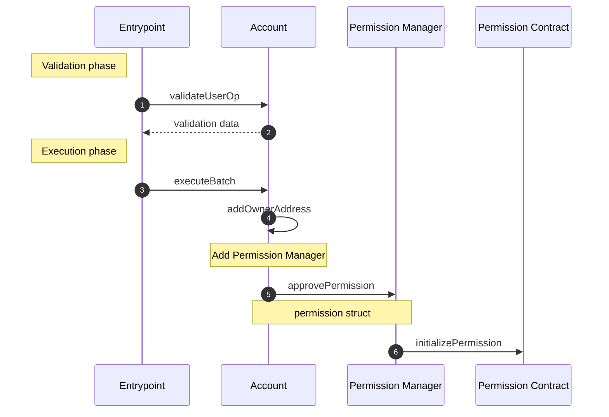

## First-Time Approval

Permissions require Smart Wallets to allow the Permission Manager as an owner to validate user operations.

When a user makes their first permission approval on a chain, we will do a transaction approval instead of a signature approval. In our call batch, we first self-call `addOwnerAddress` on the Smart Wallet to add the Permission Manager as an owner. The second call in the batch is to `PermissionManager.approvePermission` to approve the permission.

By doing a transaction approval for a chain's first-use, we are able to batch in the owner addition in the same passkey signature request to the user.

