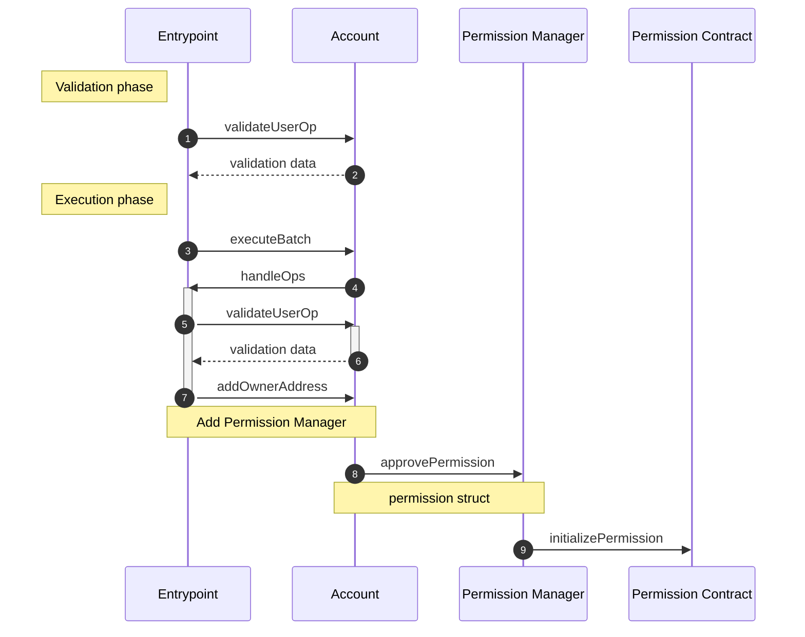

## First-Time Approval

Existing Smart Wallets must first add the Permission Manager as an owner in order for it to process permissioned user operations. This owner addition also needs to be replayed for each network the user tries to transact on. Our goal is to minimize confirmation steps for users to enable this, so we lean into combining our existing replayable user operation mechanism with our ability to batch permission approval calls in a user operation.

First, we need to the user to sign a chain-agnostic, zero-gas user operation that adds the Permission Manager as an owner. The chain-agnosticism and zero-gas parameters allow anyone to submit this user operation to an Entrypoint on any network in any gas conditions and still execute the owner change.

When a user makes their first permission approval on a chain, Smart Wallet pulls this signed user operation and batch two calls together to add the owner and approve the permission.

The first call in the batch is to `EntryPoint.handleOps` with our previously signed no-gas user operation. The Entrypoint performs its typical validation against the Smart Wallet and then calls the `addOwnerAddress` function. Because the user operation has zero-gas parameters and no paymaster, there is no required prefund withdrawn from the Smart Wallet in validation phase.

The second call in the batch is to `PermissionManager.approvePermission` to approve the permission. Because the call is made from the Smart Wallet, the Permission Manager will not require an approval signature packed into the `Permission` argument, saving our user from this additional signature.

