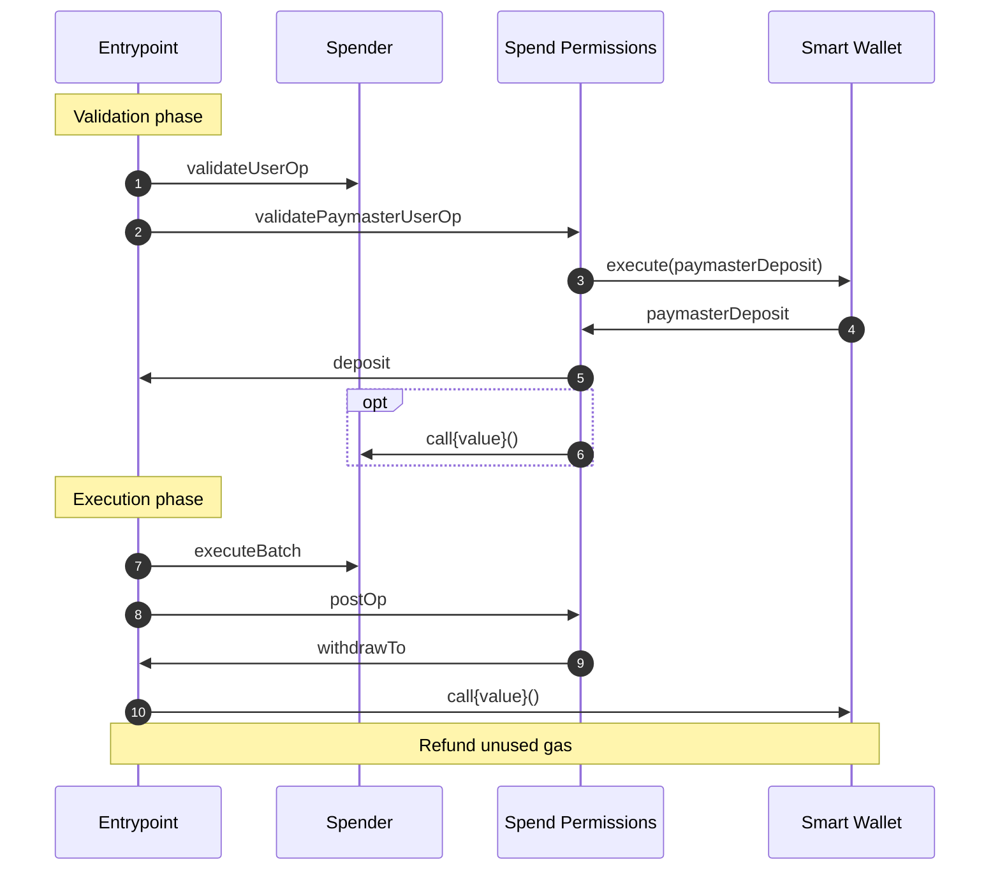

# Use Spend Permissions as a Paymaster

Using Spend Permissions as a Paymaster enables spending a recurring allowance on gas so that the spender does not need to have gas in their account to initiate a withdraw. Native token in excess of gas payment can be withdrawn simultaneously and withdrawing ERC-20s must be done with the explicit `withdraw` call in execution phase.

