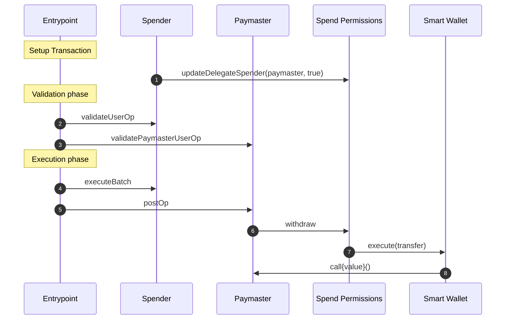

# Use Spend Permissions with a Paymaster

Using Spend Permissions with a Paymaster enables spending a recurring allowance on gas so that the spender does not need to have gas in their account to initiate a withdraw.

