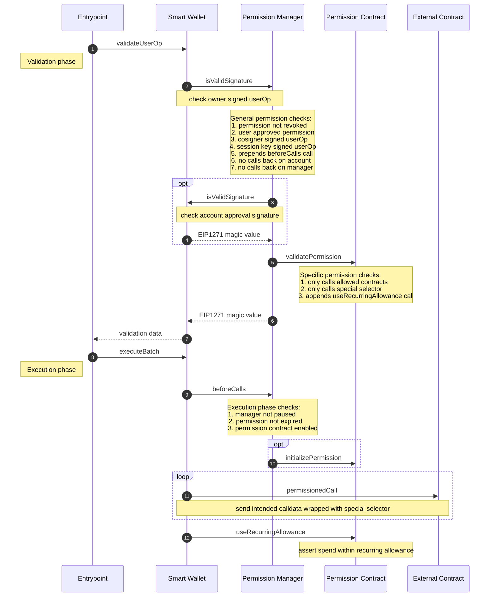

## User Operation Validation

```mermaid
sequenceDiagram
    autonumber
    participant E as Entrypoint
    participant A as Smart Wallet
    participant M as Permission Manager
    participant P as Permission Contract
    participant C as External Contract

    E->>A: validateUserOp
    Note left of E: Validation phase
    A->>M: isValidSignature
    Note over A,M: check owner signed userOp
    Note over M: General permission checks: ‎ ‎ <br/> 1. permission not revoked ‎  ‎ ‎ ‎ <br/> 2. user approved permission <br/> 3. cosigner signed userOp ‎ ‎ ‎ ‎ <br/> 4. session key signed userOp <br/> 5. prepends beforeCalls call ‎ <br/> 6. no calls back on account ‎ ‎ <br/> 7. no calls back on manager ‎
    opt
        M->>A: isValidSignature
        Note over M,A: check account approval signature
        A-->>M: EIP1271 magic value
    end
    M->>P: validatePermission
    Note over P: Specific permission checks: ‎ ‎ ‎ ‎ ‎ ‎ ‎ ‎ ‎ ‎ ‎ ‎ ‎ ‎ ‎ ‎ ‎ <br/> 1. only calls allowed contracts ‎ ‎ ‎ ‎ ‎ ‎ ‎ ‎ ‎ ‎ ‎ ‎ ‎ <br/> 2. only calls special selector ‎ ‎ ‎ ‎ ‎ ‎ ‎ ‎ ‎ ‎ ‎ ‎ ‎ ‎ ‎ ‎ <br/> 3. appends useRecurringAllowance call
    M-->>A: EIP1271 magic value
    A-->>E: validation data
    E->>A: executeBatch
    Note left of E: Execution phase
    A->>M: beforeCalls
    Note over M: Execution phase checks: ‎ ‎ ‎ ‎ ‎ ‎ ‎ ‎ ‎ ‎  <br/> 1. manager not paused ‎ ‎ ‎ ‎ ‎ ‎ ‎ ‎ ‎ ‎ ‎ ‎ <br/> 2. permission not expired ‎ ‎ ‎ ‎ ‎ ‎ ‎ ‎ <br/> 3. permission contract enabled
    opt
        M->>P: initializePermission
    end
    loop
        A->>C: permissionedCall
        Note over C,A: send intended calldata wrapped with special selector
    end
    A->>P: useRecurringAllowance
    Note over P: assert spend within recurring allowance
```
