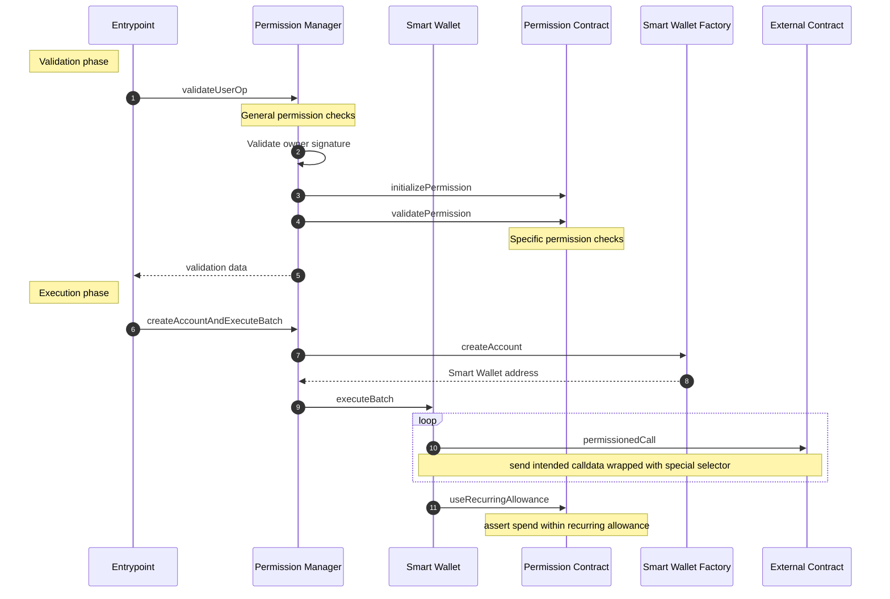

## Pre-Deployed Account User Operation Validation

```mermaid
sequenceDiagram
    autonumber
    participant E as Entrypoint
    participant M as Permission Manager
    participant A as Smart Wallet
    participant P as Permission Contract
    participant F as Smart Wallet Factory
    participant C as External Contract

    Note left of E: Validation phase
    E->>M: validateUserOp
    Note over M: General permission checks
    M->>M: Validate owner signature
    M->>P: initializePermission
    M->>P: validatePermission
    Note over P: Specific permission checks
    M-->>E: validation data
    Note left of E: Execution phase
    E->>M: createAccountAndExecuteBatch
    M->>F: createAccount
    F-->>M: Smart Wallet address
    M->>A: executeBatch
    loop
        A->>C: permissionedCall
        Note over C,A: send intended calldata wrapped with special selector
    end
    A->>P: useRecurringAllowance
    Note over P: assert spend within recurring allowance
```
