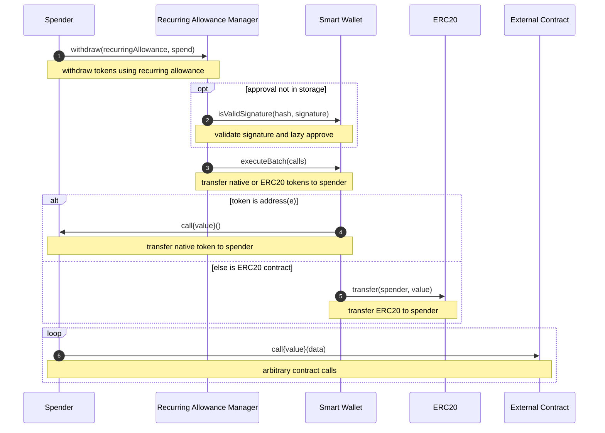

# Withdraw from Recurring Allowance

```mermaid
sequenceDiagram
    autonumber
    participant S as Spender
    participant M as Recurring Allowance Manager
    participant A as Smart Wallet
    participant ERC20
    participant EC as External Contract

    S->>M: withdraw(recurringAllowance, spend)
    Note over S,M: withdraw tokens using recurring allowance
    opt approval not in storage
        M->>A: isValidSignature(hash, signature)
        Note over M,A: validate signature and lazy approve
    end
    M->>A: executeBatch(calls)
    Note over M,A: transfer native or ERC20 tokens to spender
    alt token is address(e)
        A->>S: call{value}()
        Note over A,S: transfer native token to spender
    else else is ERC20 contract
        A->>ERC20: transfer(spender, value)
        Note over A,ERC20: transfer ERC20 to spender
    end
    loop
        S->>EC: call{value}(data)
        Note over S,EC: arbitrary contract calls
    end
```
