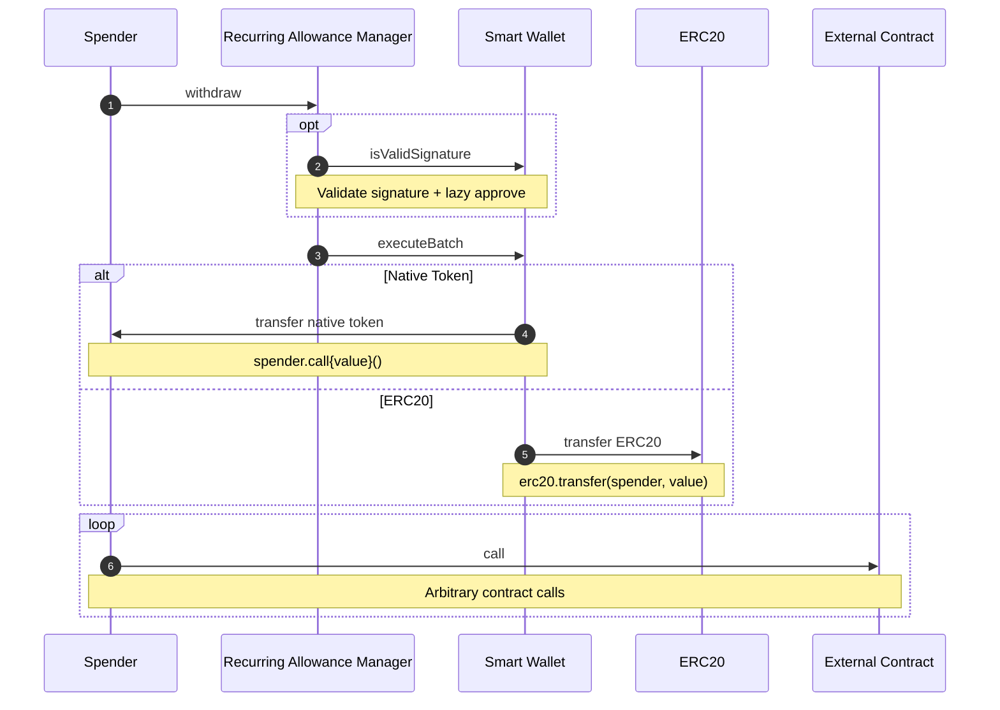

# Withdraw from Recurring Allowance

```mermaid
sequenceDiagram
    autonumber
    participant S as Spender
    participant M as Recurring Allowance Manager
    participant A as Smart Wallet
    participant ERC20
    participant EC as External Contract

    S->>M: withdraw
    opt
        M->>A: isValidSignature
        Note over M,A: Validate signature + lazy approve
    end
    M->>A: executeBatch
    alt Native Token
        A->>S: transfer native token
        Note over A,S: spender.call{value}()
    else ERC20
        A->>ERC20: transfer ERC20
        Note over A,ERC20: erc20.transfer(spender, value)
    end
    loop
        S->>EC: call
        Note over S,EC: Arbitrary contract calls
    end
```
