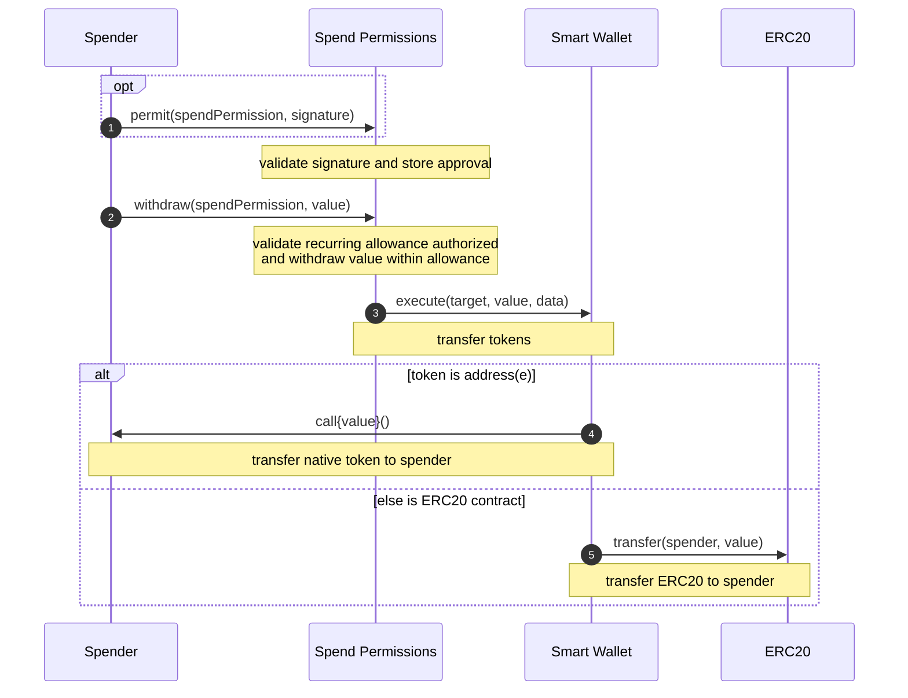

# Withdraw from Spend Permissions

The first time using a recurring allowance, the spender needs to pack an additional `permit` call before withdrawing to validate and store the approval. After a recurring allowance has been approved, the spender only needs to call `withdraw` to transfer tokens from the Smart Wallet.

