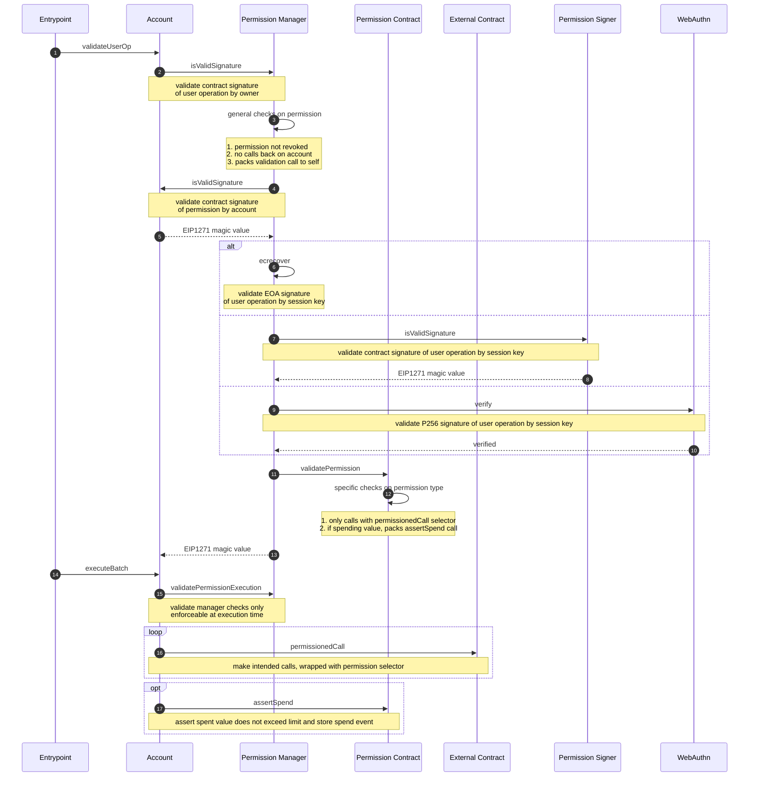

## Onchain Validation

```mermaid
sequenceDiagram
    autonumber
    participant E as Entrypoint
    participant A as Account
    participant M as Permission Manager
    participant P as Permission Contract
    participant C as External Contract
    participant S as Permission Signer
    participant W as WebAuthn

    E->>A: validateUserOp
    A->>M: isValidSignature
    Note over M,A: validate contract signature <br/>of user operation by owner
    M->>M: general checks on permission
    Note over M: 1. permission not revoked ‎ ‎ ‎ ‎ ‎ ‎ ‎<br/>2. no calls back on account‎ ‎ ‎ ‎ ‎ ‎<br/>3. packs validation call to self ‎
    M->>A: isValidSignature
    Note over M,A: validate contract signature<br />of permission by account
    A-->>M: EIP1271 magic value
    alt
        M->>M: ecrecover
        Note over M: validate EOA signature <br/>of user operation by session key
    else
        M->>S: isValidSignature
        Note over M,S: validate contract signature of user operation by session key
        S-->>M: EIP1271 magic value
    else
        M->>W: verify
        Note over M,W: validate P256 signature of user operation by session key
        W-->>M: verified
    end
    M->>P: validatePermission
    P->>P: specific checks on permission type
    Note over P: 1. only calls with permissionedCall selector<br/>2. if spending value, packs assertSpend call
    M-->>A: EIP1271 magic value
    E->>A: executeBatch
    A->>M: validatePermissionExecution
    Note over M,A: validate manager checks only <br/>enforceable at execution time
    loop
        A->>C: permissionedCall
        Note over C,A: make intended calls, wrapped with permission selector
    end
    opt
        A->>P: assertSpend
        Note over A,P: assert spent value does not exceed limit and store spend event
    end

```
