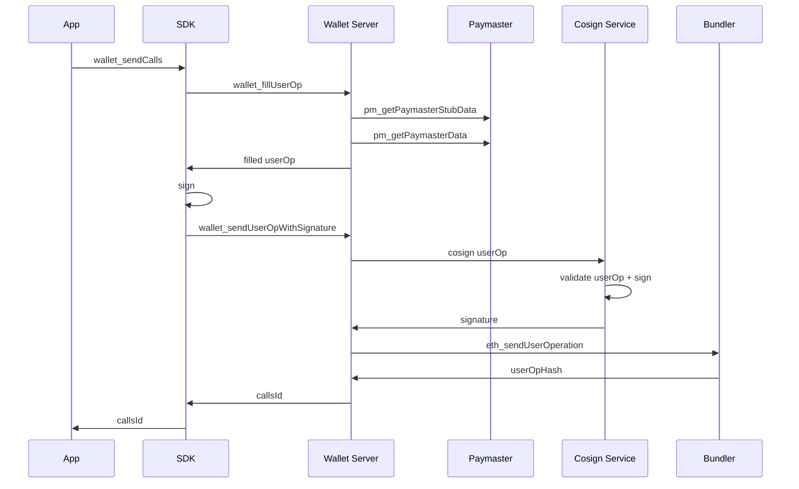

```mermaid
sequenceDiagram
    App->>SDK: wallet_sendCalls
    SDK->>Wallet Server: wallet_fillUserOp
    Wallet Server->>Paymaster: pm_getPaymasterStubData
    Wallet Server->>Paymaster: pm_getPaymasterData
    Wallet Server->>SDK: filled userOp
    SDK->>SDK: sign
    SDK->>Wallet Server: wallet_sendUserOpWithSignature
    Wallet Server->>Cosign Service: cosign userOp
    Cosign Service->>Cosign Service: validate userOp + sign
    Cosign Service->>Wallet Server: signature
    Wallet Server->>Bundler: eth_sendUserOperation
    Bundler->>Wallet Server: userOpHash
    Wallet Server->>SDK: callsId
    SDK->>App: callsId
```
