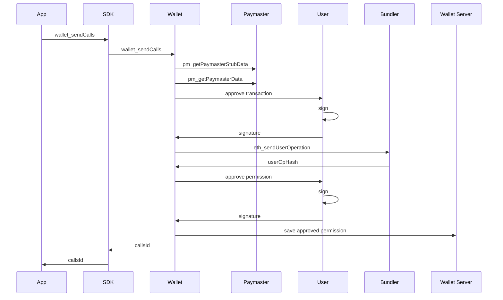

## Send Calls with Grant Permissions Request Capability

```mermaid
sequenceDiagram
    App->>SDK: wallet_sendCalls
    SDK->>Wallet: wallet_sendCalls
    Wallet->>Paymaster: pm_getPaymasterStubData
    Wallet->>Paymaster: pm_getPaymasterData
    Wallet->>User: approve transaction
    User->>User: sign
    User->>Wallet: signature
    Wallet->>Bundler: eth_sendUserOperation
    Bundler->>Wallet: userOpHash
    Wallet->>User: approve permission
    User->>User: sign
    User->>Wallet: signature
    Wallet->>Wallet Server: save approved permission
    Wallet->>SDK: callsId
    SDK->>App: callsId
```
